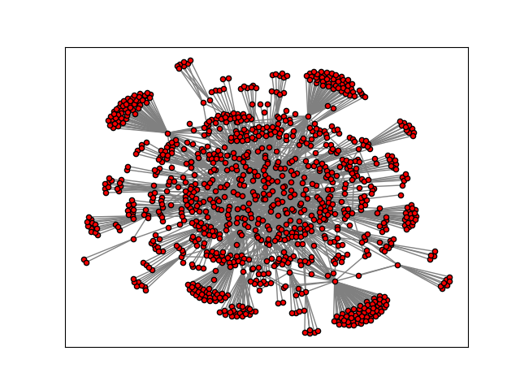
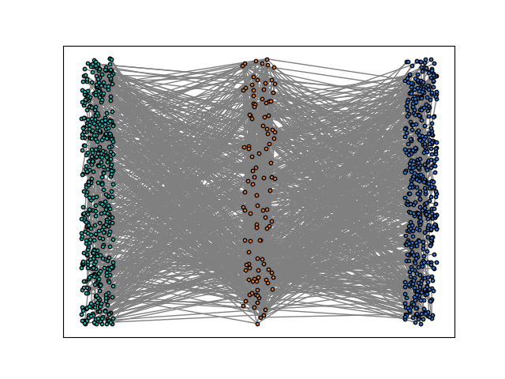

[](
   https://circleci.com/gh/dwave-examples/immunization-strategy)

# Immunization Strategy

There are many different strategies for immunizing populations in order to
prevent transmission of a virus or an infectious disease with a minimal number
of doses.  One such strategy, outlined in [1], is to fragment a population into
into two large groups of similar size and a third group known as the separator. 
This strategy partitions a population into two large groups of similar size and
a third separator group. The separator is chosen so that all connections
between the two larger groups pass through it, and should be kept as small as
possible. In this scenario, removing the separator  from the population 
disconnects the two large groups, preventing transmission of the infection
between the groups. Immunizing the separator then breaks the transmission
cycle, and so selecting a separator that contains as few individuals as
possible will minimize the number of immunization doses required. In this
example, we show how this optimization problem can be implemented using the
Ocean SDK and solved using the hybrid discrete quadratic model solver available
in Leap.

## Usage

To run the demo, type:

```bash
python demo.py
```

Additional options are available to select different graphs to run the problem
on. To see the full list of options, type:

```bash
python demo.py -h
```

During a successful run of the program, two images are produced and saved. The
first is the original input graph, saved as `input_graph.png`.



The second highlights the partition of the population into large groups (left
and right) and separator (center).



### Graphs Available

Several different types of graphs or networks are available for this demo using
the options provided. These are all built using NetworkX graph generator
functions, and the details of these functions can be found
[here](https://networkx.org/documentation/stable//reference/generators.html#).

- `karate`: Karate Club graph; a fixed graph on 34 nodes.
- `internet`: Internet Autonomous System network; specify number nodes between
  1,000 and 5,000.
- `rand-reg`: A random d-regular graph; specify number of nodes and value for d.
- `ER`: Erdos-Renyi random graph; specify number of nodes and edge probability.
- `SF`: Barabsi-Albert scale-free graph; specify number of nodes and number of
  edges to add from a new node to any existing nodes.

The default graph is the internet graph on 1,000 nodes. The largest number of 
nodes allowed for any graph specified can be at most 5,000.

## Code Overview

Given a population represented as a graph, the optimization problem can be
broken down into the following objective and constraints.

- Objective: Minimize the number of nodes in the separator
- Constraint 1: Large groups have equal size
- Constraint 2: No edges between the large groups

This problem can be modeled as a discrete quadratic model (DQM). We assign a
variable for each node in the graph, and each variable has three cases: one for
each large group and one for the separator group. A variable can be assigned to
exactly one of those three groups.

## References

[1] Chen, Yiping, et al. "Finding a better immunization strategy." Physical
review letters 101.5 (2008): 058701.

## License

Released under the Apache License 2.0. See [LICENSE](LICENSE) file.
